# PCRAG Paper Figures — Mermaid Diagram Source

---

## Figure 1: System Model

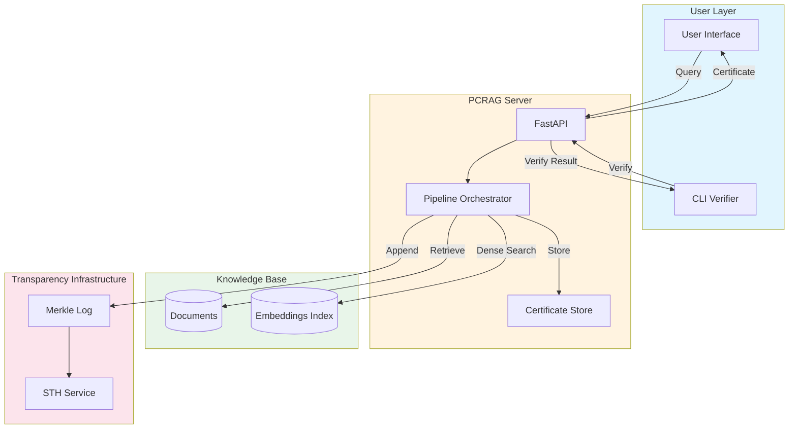

---

## Figure 2: PCRAG 8-Stage Pipeline

```mermaid
flowchart LR
    subgraph Input["Input"]
        Q[Query]
    end
    
    subgraph Stage1["Stage 1"]
        R[Retrieve]
        R1[BM25]
        R2[Dense]
        R3[RRF Fusion]
    end
    
    subgraph Stage2["Stage 2"]
        G[Generate]
        G1[Groq LLM]
    end
    
    subgraph Stage3["Stage 3"]
        C[Claims]
        C1[LLM Decompose]
    end
    
    subgraph Stage4["Stage 4"]
        S[Spans]
        S1[Embedding Similarity]
    end
    
    subgraph Stage5["Stage 5"]
        V[Verify]
        V1[DeBERTa NLI]
    end
    
    subgraph Stage6["Stage 6"]
        B[Build Cert]
        B1[SHA-256 Hashes]
    end
    
    subgraph Stage7["Stage 7"]
        SG[Sign]
        SG1[JCS + Ed25519]
    end
    
    subgraph Stage8["Stage 8"]
        TL[Log]
        TL1[Merkle Append]
    end
    
    subgraph Output["Output"]
        SC[SignedCertificate]
    end
    
    Q --> R
    R --> R1 & R2
    R1 & R2 --> R3
    R3 --> G --> G1
    G1 --> C --> C1
    C1 --> S --> S1
    S1 --> V --> V1
    V1 --> B --> B1
    B1 --> SG --> SG1
    SG1 --> TL --> TL1
    TL1 --> SC
    
    style Input fill:#e3f2fd
    style Output fill:#c8e6c9
```

---

## Figure 3: Pipeline Sequence Diagram

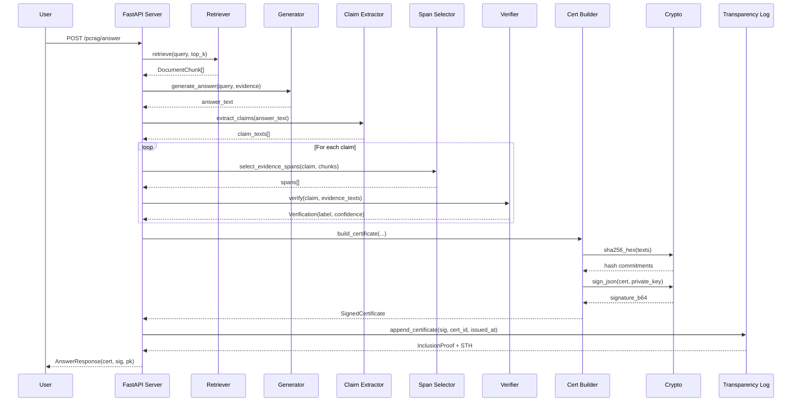

---

## Figure 4: Certificate Schema Class Diagram

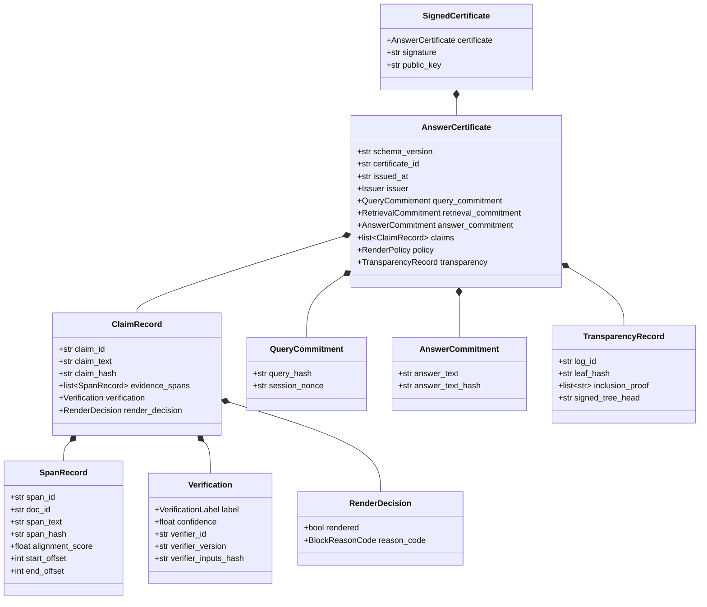

---

## Figure 5: Attack Taxonomy

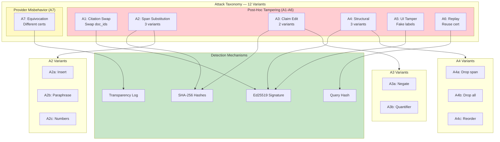

---

## Figure 6: Merkle Tree Structure

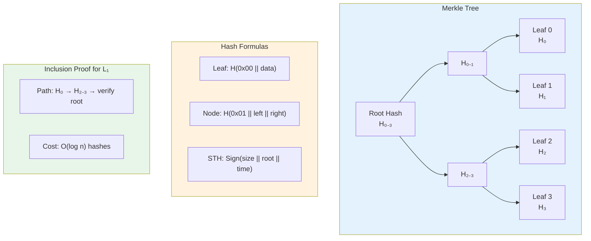

---

## Figure 7: Verification Flow

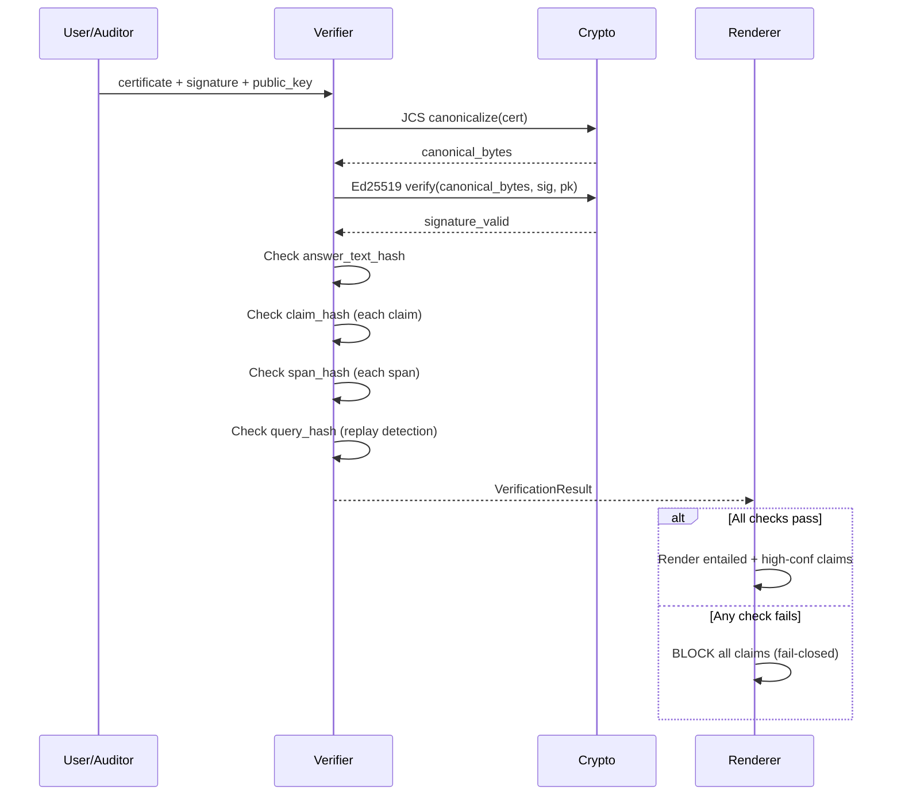

---

## Figure 8: Component Dependency Graph

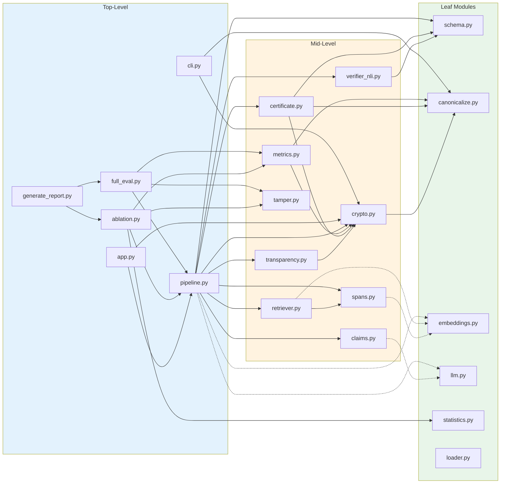

---

## Figure 9: React Renderer Component Tree

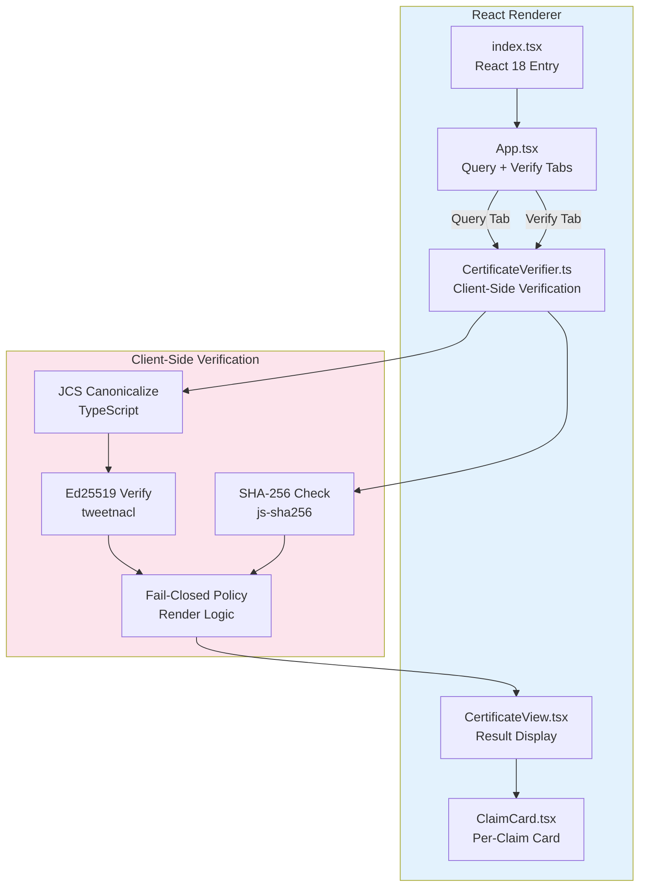

---

## Figure 10: Evaluation Pipeline

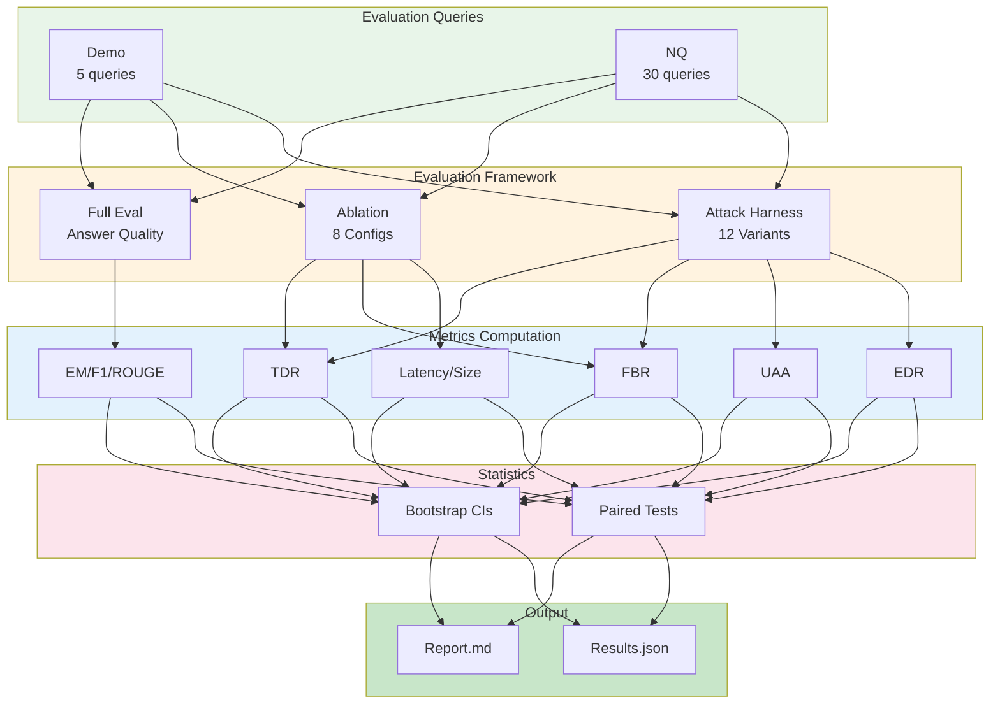

---

## Figure 11: Cryptographic Signing Flow

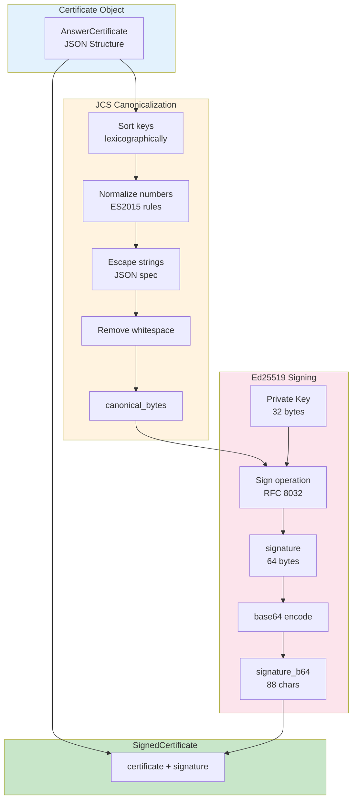

---

## Figure 12: Fail-Closed Render Decision Tree

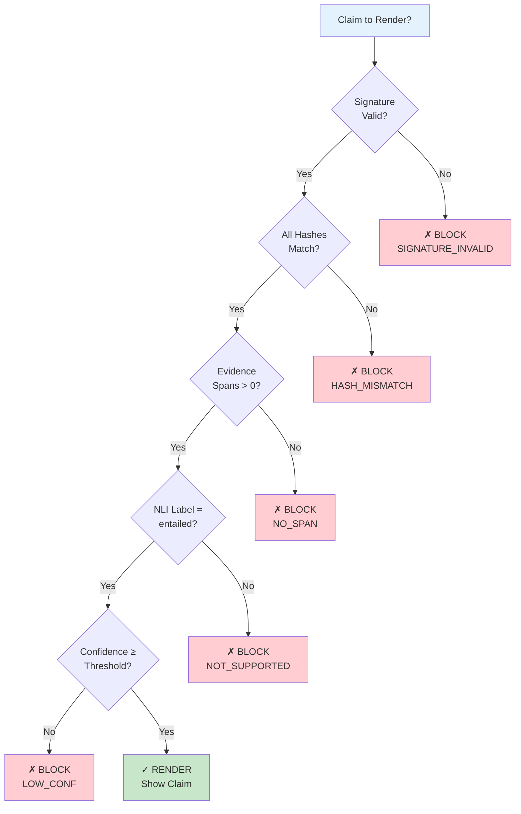

---

## Figure 13: Ablation Component Contribution

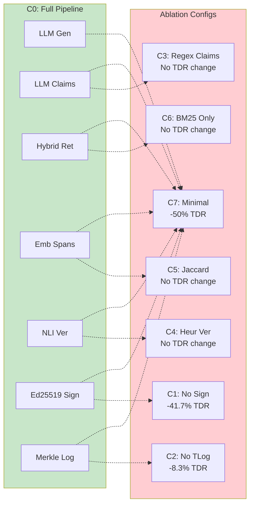

---

## Figure 14: API Endpoint Architecture

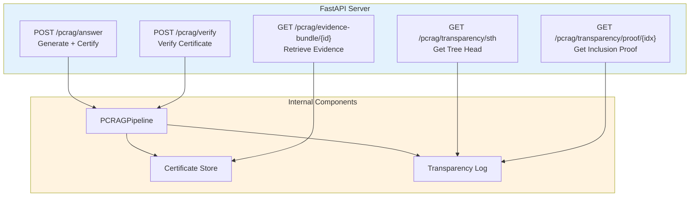

